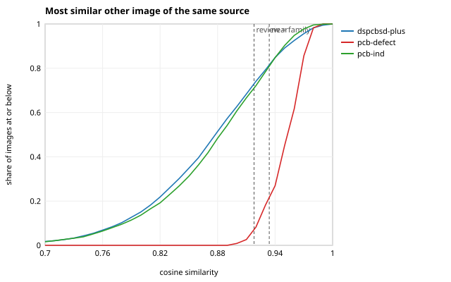

# M3 similarity summary

Generated by `openinspect dedup analyze` from `artifacts/m3/audit.json` (re-render with `openinspect dedup report`). Rules: [docs/M3_PROTOCOL.md](../../docs/M3_PROTOCOL.md) (frozen before any leakage number was computed) and [docs/M3_PROTOCOL_AMENDMENT.md](../../docs/M3_PROTOCOL_AMENDMENT.md). Code: `a030e7b111f1`; seed 0.

A *visual similarity component* (a potential leakage group) is a connected component of image pairs whose embedding cosine reaches a threshold: evidence of potential leakage, not proof that two images show the same physical object. No image was deleted, excluded or re-labelled.

## Run

| item | value |
|---|---|
| model | `facebook/dinov2-small` at revision `ed25f3a31f01` (weights SHA-256 `ae1e99fcefd5…`), 384 dimensions |
| preprocessing, backend | `v1`, `cpu-fp32` |
| perceptual hash | `phash-v1` (64-bit DCT hash); dHash from ingest |
| images | 15,278; failed to read or decode: 0 (undecodable at ingest: 0) |

## Inputs

| source | images | annotations | with features | failed | original splits | group key | acquisition kind |
|---|---|---|---|---|---|---|---|
| `dspcbsd-plus` | 10,259 | 20,276 | 10,259 | 0 | train 8,208 / val 2,051 | none | factory-aoi |
| `pcb-defect` | 230 | 1,704 | 230 | 0 | none 230 | design family A | lab-flatbed-scan |
| `pcb-ind` | 4,789 | 5,932 | 4,789 | 0 | train 3,833 / val 478 / test 478 | batch | factory-aoi |

## Thresholds (protocol section 6, applied mechanically)

| level | value | category it opens |
|---|---|---|
| near | 0.9339 | `NEAR_DUPLICATE` at or above |
| family | 0.9180 | `SAME_FAMILY_OR_SCENE` from here up to near |
| review | 0.9180 | `REVIEW_REQUIRED` from here up to family |
| pHash candidate | <= 4 bits | `REVIEW_REQUIRED` when the hash is this close but the cosine is under review |

Fallbacks the rule applied (rule 5):

- `pcb-defect` family A: precision 0.90 is never reached: the F1-optimal cosine is used
- `pcb-defect` (A, B): precision 0.90 is never reached: the F1-optimal cosine is used
- `pcb-ind` (batch, side): precision 0.90 is never reached: the F1-optimal cosine is used; precision 0.50 is never reached: the F1-optimal cosine is used

The review and family thresholds coincide, so no pair is `REVIEW_REQUIRED` by cosine alone; that category holds only pairs whose pHash is close while the cosine is not.

How each value was obtained: [threshold-calibration.md](threshold-calibration.md).

## Exact duplicates

Identical SHA-256: 0 pairs in 0 groups over all 15,278 images, 0 of them across sources.

## Candidate pairs by machine category

Counts of image pairs; in brackets the pairs whose two images sit in different official splits of the same source.

| scope | `EXACT_DUPLICATE` | `NEAR_DUPLICATE` | `SAME_FAMILY_OR_SCENE` | `REVIEW_REQUIRED` |
|---|---|---|---|---|
| `within:dspcbsd-plus` | 0 (0) | 3,211 (893) | 3,620 (1,029) | 1,863 (645) |
| `within:pcb-defect` | 0 (0) | 410 (0) | 905 (0) | 0 (0) |
| `within:pcb-ind` | 0 (0) | 1,466 (363) | 1,799 (469) | 919 (266) |
| `across` | 0 (0) | 30 (0) | 85 (0) | 345 (0) |

## Most similar other image of the same source (no threshold)

| source | images | top-1 cosine: median (p05 to p95) | max | >= review | >= family | >= near | nearest image of all is in another source (>= family) |
|---|---|---|---|---|---|---|---|
| `dspcbsd-plus` | 10,259 | 0.878 (0.746 to 0.967) | 1.000 | 27.0% | 27.0% | 18.8% | 337 (5) |
| `pcb-defect` | 230 | 0.952 (0.915 to 0.976) | 0.982 | 93.0% | 93.0% | 80.0% | 0 (0) |
| `pcb-ind` | 4,789 | 0.883 (0.748 to 0.961) | 0.992 | 28.8% | 28.8% | 19.0% | 138 (3) |

Does the most similar image share the source's own key?

| source | shares the group key | chance | shares the subgroup key | chance |
|---|---|---|---|---|
| `pcb-defect` | 72.2% | 4.9% | 71.3% | 2.4% |
| `pcb-ind` | 30.3% | 0.9% | 28.8% | 0.6% |

## Hash audit

Pairs within a Hamming distance, at a published reference distance (3 bits, used by one source's authors to deduplicate inside a production batch) and at the calibrated candidate distance (4 bits). Same group and subgroup refer to the source's own proxy keys.

| hash | bits | scope | pairs | same subgroup | same group, other subgroup | other group | cross-split |
|---|---|---|---|---|---|---|---|
| phash | 3 | `within:dspcbsd-plus` | 934 | n/a | n/a | n/a | 302 |
| phash | 3 | `within:pcb-defect` | 0 | 0 | 0 | 0 | n/a |
| phash | 3 | `within:pcb-ind` | 435 | 0 | 0 | 435 | 123 |
| phash | 3 | `across:dspcbsd-plus|pcb-defect` | 0 | n/a | n/a | n/a | n/a |
| phash | 3 | `across:dspcbsd-plus|pcb-ind` | 109 | n/a | n/a | n/a | n/a |
| phash | 3 | `across:pcb-defect|pcb-ind` | 0 | n/a | n/a | n/a | n/a |
| phash | 4 | `within:dspcbsd-plus` | 2,311 | n/a | n/a | n/a | 797 |
| phash | 4 | `within:pcb-defect` | 2 | 1 | 1 | 0 | n/a |
| phash | 4 | `within:pcb-ind` | 1,025 | 65 | 2 | 958 | 304 |
| phash | 4 | `across:dspcbsd-plus|pcb-defect` | 0 | n/a | n/a | n/a | n/a |
| phash | 4 | `across:dspcbsd-plus|pcb-ind` | 345 | n/a | n/a | n/a | n/a |
| phash | 4 | `across:pcb-defect|pcb-ind` | 0 | n/a | n/a | n/a | n/a |
| dhash | 3 | `within:dspcbsd-plus` | 2,282 | n/a | n/a | n/a | 659 |
| dhash | 3 | `within:pcb-defect` | 2 | 2 | 0 | 0 | n/a |
| dhash | 3 | `within:pcb-ind` | 847 | 36 | 2 | 809 | 327 |
| dhash | 3 | `across:dspcbsd-plus|pcb-defect` | 0 | n/a | n/a | n/a | n/a |
| dhash | 3 | `across:dspcbsd-plus|pcb-ind` | 1,710 | n/a | n/a | n/a | n/a |
| dhash | 3 | `across:pcb-defect|pcb-ind` | 0 | n/a | n/a | n/a | n/a |
| dhash | 4 | `within:dspcbsd-plus` | 3,180 | n/a | n/a | n/a | 922 |
| dhash | 4 | `within:pcb-defect` | 3 | 3 | 0 | 0 | n/a |
| dhash | 4 | `within:pcb-ind` | 1,018 | 46 | 2 | 970 | 387 |
| dhash | 4 | `across:dspcbsd-plus|pcb-defect` | 0 | n/a | n/a | n/a | n/a |
| dhash | 4 | `across:dspcbsd-plus|pcb-ind` | 2,226 | n/a | n/a | n/a | n/a |
| dhash | 4 | `across:pcb-defect|pcb-ind` | 0 | n/a | n/a | n/a | n/a |

Share of pHash-candidate pairs whose two images also share a family-level similarity group: `dspcbsd-plus` 23.6%; `pcb-defect` 100.0%; `pcb-ind` 37.1%.

## Across sources

| level | sources | pairs | images of the first | images of the second |
|---|---|---|---|---|
| review | `dspcbsd-plus` / `pcb-defect` | 0 | 0 | 0 |
| family | `dspcbsd-plus` / `pcb-defect` | 0 | 0 | 0 |
| near | `dspcbsd-plus` / `pcb-defect` | 0 | 0 | 0 |
| review | `dspcbsd-plus` / `pcb-ind` | 115 | 36 | 41 |
| family | `dspcbsd-plus` / `pcb-ind` | 115 | 36 | 41 |
| near | `dspcbsd-plus` / `pcb-ind` | 30 | 9 | 13 |
| review | `pcb-defect` / `pcb-ind` | 0 | 0 | 0 |
| family | `pcb-defect` / `pcb-ind` | 0 | 0 | 0 |
| near | `pcb-defect` / `pcb-ind` | 0 | 0 | 0 |

Most similar pairs across sources:

| cosine | image | image |
|---|---|---|
| 0.9547 | `dspcbsd-plus:Data_COCO/train2017/Y_002088.jpg` | `pcb-ind:YOLO/images/train/5813_b_005.jpg` |
| 0.9522 | `dspcbsd-plus:Data_COCO/train2017/Y_002088.jpg` | `pcb-ind:YOLO/images/train/5811_b_002.jpg` |
| 0.9449 | `dspcbsd-plus:Data_COCO/train2017/Y_002017.jpg` | `pcb-ind:YOLO/images/train/5813_b_005.jpg` |
| 0.9432 | `dspcbsd-plus:Data_COCO/val2017/Y_001992.jpg` | `pcb-ind:YOLO/images/train/5811_b_002.jpg` |
| 0.9432 | `dspcbsd-plus:Data_COCO/train2017/Y_002083.jpg` | `pcb-ind:YOLO/images/train/6492_b_009.jpg` |
| 0.9431 | `dspcbsd-plus:Data_COCO/train2017/Y_002082.jpg` | `pcb-ind:YOLO/images/train/5811_b_002.jpg` |
| 0.9430 | `dspcbsd-plus:Data_COCO/train2017/Y_002040.jpg` | `pcb-ind:YOLO/images/train/6492_b_009.jpg` |
| 0.9422 | `dspcbsd-plus:Data_COCO/train2017/E_003960.jpg` | `pcb-ind:YOLO/images/train/6452_b_006.jpg` |
| 0.9420 | `dspcbsd-plus:Data_COCO/train2017/E_003960.jpg` | `pcb-ind:YOLO/images/train/5813_b_005.jpg` |
| 0.9418 | `dspcbsd-plus:Data_COCO/train2017/Y_001995.jpg` | `pcb-ind:YOLO/images/train/5811_b_002.jpg` |

