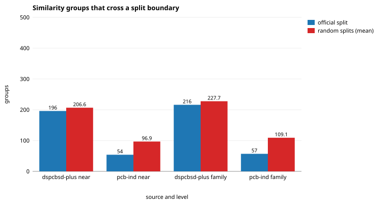
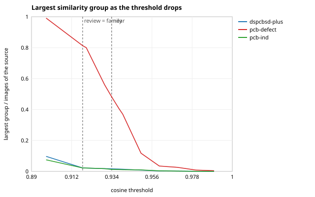

# M3 split leakage

Generated by `openinspect dedup analyze` from `artifacts/m3/audit.json` (re-render with `openinspect dedup report`). Rules: [docs/M3_PROTOCOL.md](../../docs/M3_PROTOCOL.md) (frozen before any leakage number was computed) and [docs/M3_PROTOCOL_AMENDMENT.md](../../docs/M3_PROTOCOL_AMENDMENT.md). Code: `a030e7b111f1`; seed 0.

A *visual similarity component* (a potential leakage group) is a connected component of image pairs whose embedding cosine reaches a threshold: evidence of potential leakage, not proof that two images show the same physical object. No image was deleted, excluded or re-labelled.

> How common is it, in the official splits, for visually very similar images to sit on both sides of a split boundary? (protocol section 1)

Groups come from the graph *within* each source (images are nodes, pairs at or above the level's cosine are edges). A group crosses a split when its members sit in two or more official splits; its images and annotations are then *affected*. `pcb-defect` has no official split.

## Official splits

| source | level | cosine | groups (2+ images) | largest group | crossing groups | train/val | train/test | val/test | affected images | affected annotations | val images with a train neighbour | test images with a train neighbour |
|---|---|---|---|---|---|---|---|---|---|---|---|---|
| `dspcbsd-plus` | near | 0.9339 | 509 | 170 | 196 | 196 | 0 | 0 | 1,191 of 10,259 (11.6%) | 2,588 | 325 of 2,051 (15.8%) | n/a |
| `pcb-defect` | near (primary) | 0.9339 | 24 | 111 | n/a | n/a | n/a | n/a | n/a | n/a | n/a | n/a |
| `pcb-ind` | near | 0.9339 | 216 | 60 | 54 | 36 | 32 | 16 | 467 of 4,789 (9.8%) | 648 | 50 of 478 (10.5%) | 62 of 478 (13.0%) |
| `dspcbsd-plus` | family (primary) | 0.9180 | 549 | 228 | 216 | 216 | 0 | 0 | 1,983 of 10,259 (19.3%) | 4,329 | 482 of 2,051 (23.5%) | n/a |
| `pcb-defect` | family | 0.9180 | 10 | 187 | n/a | n/a | n/a | n/a | n/a | n/a | n/a | n/a |
| `pcb-ind` | family (primary) | 0.9180 | 237 | 107 | 57 | 33 | 38 | 18 | 842 of 4,789 (17.6%) | 1,174 | 79 of 478 (16.5%) | 85 of 478 (17.8%) |

**Chaining rule** (protocol section 8): a source whose largest family-level group holds more than 25% of its images is flagged, and its near-level numbers become the primary ones. Flagged: `pcb-defect`.

## Against random splits of the same sizes

The split labels of each source are shuffled 1,000 times (seed 0), keeping the split sizes; each shuffle is scored on the same groups.

| source | level | crossing groups, official | random splits: mean ± sd | p (as few or fewer) | p (as many or more) | reading |
|---|---|---|---|---|---|---|
| `dspcbsd-plus` | near | 196 | 206.6 ± 10.5 | 0.169 | 0.852 | consistent with random splits |
| `pcb-ind` | near | 54 | 96.9 ± 6.5 | < 0.001 | 1.000 | fewer than random splits (p < 0.001) |
| `dspcbsd-plus` | family | 216 | 227.7 ± 10.7 | 0.145 | 0.875 | consistent with random splits |
| `pcb-ind` | family | 57 | 109.1 ± 6.6 | < 0.001 | 1.000 | fewer than random splits (p < 0.001) |

## A group-aware split with the official sizes (seed 0)

Whole similarity groups are assigned to splits, largest first. The crossing count is measured on the result, not assumed. The last columns give each evaluation image's highest cosine to any training image (median, p05 to p95), official against group-aware.

| source | level | official split | group-aware split | largest share error | crossing groups after | val to train, official | val to train, group-aware | test to train, official | test to train, group-aware |
|---|---|---|---|---|---|---|---|---|---|
| `dspcbsd-plus` | near | train 8,208 / val 2,051 | train 8,208 / val 2,051 | 0.0% | 0 | 0.871 (0.741 to 0.964) | 0.855 (0.729 to 0.925) | n/a | n/a |
| `pcb-ind` | near | train 3,833 / val 478 / test 478 | train 3,833 / val 478 / test 478 | 0.0% | 0 | 0.853 (0.617 to 0.947) | 0.862 (0.729 to 0.927) | 0.851 (0.709 to 0.952) | 0.861 (0.742 to 0.928) |
| `dspcbsd-plus` | family | train 8,208 / val 2,051 | train 8,208 / val 2,051 | 0.0% | 0 | 0.871 (0.741 to 0.964) | 0.848 (0.725 to 0.912) | n/a | n/a |
| `pcb-ind` | family | train 3,833 / val 478 / test 478 | train 3,833 / val 478 / test 478 | 0.0% | 0 | 0.853 (0.617 to 0.947) | 0.855 (0.730 to 0.911) | 0.851 (0.709 to 0.952) | 0.853 (0.741 to 0.910) |

## Percolation

Groups and the largest group as the threshold drops, per source.

| source | cosine | pairs | groups | images in groups | largest group | crossing groups | affected images |
|---|---|---|---|---|---|---|---|
| `dspcbsd-plus` | 0.9900 | 27 | 27 | 54 | 2 (0.0%) | 8 | 16 |
| `dspcbsd-plus` | 0.9800 | 112 | 81 | 181 | 7 (0.1%) | 25 | 57 |
| `dspcbsd-plus` | 0.9700 | 342 | 180 | 447 | 20 (0.2%) | 62 | 188 |
| `dspcbsd-plus` | 0.9600 | 719 | 282 | 766 | 29 (0.3%) | 104 | 355 |
| `dspcbsd-plus` | 0.9500 | 1,353 | 351 | 1,112 | 86 (0.8%) | 129 | 579 |
| `dspcbsd-plus` | 0.9400 | 2,300 | 444 | 1,555 | 145 (1.4%) | 159 | 872 |
| `dspcbsd-plus` | 0.9380 | 2,566 | 465 | 1,670 | 152 (1.5%) | 172 | 966 |
| `dspcbsd-plus` | 0.9339 | 3,211 | 509 | 1,927 | 170 (1.7%) | 196 | 1,191 |
| `dspcbsd-plus` | 0.9300 | 3,854 | 536 | 2,119 | 182 (1.8%) | 205 | 1,330 |
| `dspcbsd-plus` | 0.9200 | 6,216 | 560 | 2,657 | 220 (2.1%) | 224 | 1,871 |
| `dspcbsd-plus` | 0.9180 | 6,831 | 549 | 2,771 | 228 (2.2%) | 216 | 1,983 |
| `dspcbsd-plus` | 0.8980 | 15,923 | 590 | 3,946 | 997 (9.7%) | 234 | 3,054 |
| `pcb-defect` | 0.9900 | 0 | 0 | 0 | 1 (0.4%) | n/a | n/a |
| `pcb-defect` | 0.9800 | 2 | 2 | 4 | 2 (0.9%) | n/a | n/a |
| `pcb-defect` | 0.9700 | 20 | 14 | 33 | 6 (2.6%) | n/a | n/a |
| `pcb-defect` | 0.9600 | 70 | 35 | 88 | 8 (3.5%) | n/a | n/a |
| `pcb-defect` | 0.9500 | 132 | 40 | 126 | 27 (11.7%) | n/a | n/a |
| `pcb-defect` | 0.9400 | 262 | 28 | 168 | 85 (37.0%) | n/a | n/a |
| `pcb-defect` | 0.9380 | 302 | 27 | 174 | 93 (40.4%) | n/a | n/a |
| `pcb-defect` | 0.9339 | 410 | 24 | 184 | 111 (48.3%) | n/a | n/a |
| `pcb-defect` | 0.9300 | 548 | 18 | 188 | 129 (56.1%) | n/a | n/a |
| `pcb-defect` | 0.9200 | 1,169 | 10 | 211 | 184 (80.0%) | n/a | n/a |
| `pcb-defect` | 0.9180 | 1,315 | 10 | 214 | 187 (81.3%) | n/a | n/a |
| `pcb-defect` | 0.8980 | 4,016 | 1 | 228 | 228 (99.1%) | n/a | n/a |
| `pcb-ind` | 0.9900 | 2 | 2 | 4 | 2 (0.0%) | 0 | 0 |
| `pcb-ind` | 0.9800 | 11 | 10 | 21 | 3 (0.1%) | 0 | 0 |
| `pcb-ind` | 0.9700 | 68 | 44 | 107 | 9 (0.2%) | 10 | 33 |
| `pcb-ind` | 0.9600 | 223 | 80 | 247 | 19 (0.4%) | 19 | 105 |
| `pcb-ind` | 0.9500 | 541 | 136 | 464 | 46 (1.0%) | 26 | 183 |
| `pcb-ind` | 0.9400 | 1,036 | 191 | 728 | 54 (1.1%) | 41 | 337 |
| `pcb-ind` | 0.9380 | 1,166 | 197 | 784 | 56 (1.2%) | 46 | 386 |
| `pcb-ind` | 0.9339 | 1,466 | 216 | 910 | 60 (1.3%) | 54 | 467 |
| `pcb-ind` | 0.9300 | 1,816 | 223 | 1,031 | 85 (1.8%) | 52 | 557 |
| `pcb-ind` | 0.9200 | 3,000 | 236 | 1,334 | 104 (2.2%) | 59 | 803 |
| `pcb-ind` | 0.9180 | 3,265 | 237 | 1,379 | 107 (2.2%) | 57 | 842 |
| `pcb-ind` | 0.8980 | 6,983 | 251 | 1,947 | 359 (7.5%) | 52 | 1,356 |

## The sources' own keys across the splits

Proxy metadata, not ground truth: a key value found in two or more splits means images that share a production batch, a design family and the like are on both sides.

| source | key | meaning | values | in two or more splits | images in those values |
|---|---|---|---|---|---|
| `pcb-ind` | `group_id` | batch | 685 | 125 (18.2%) | 1,233 |
| `pcb-ind` | `subgroup_id` | (batch, side) | 1,069 | 0 (0.0%) | 0 |

