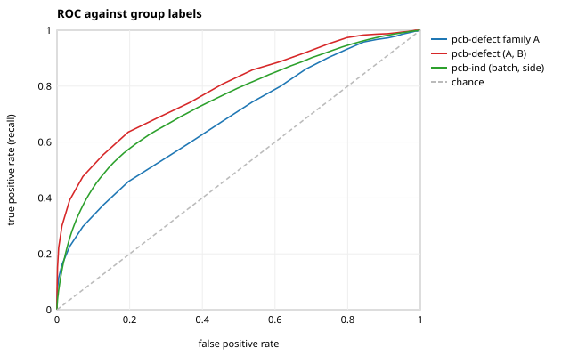
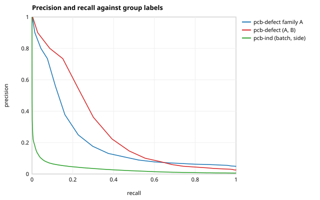
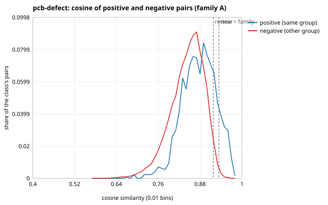
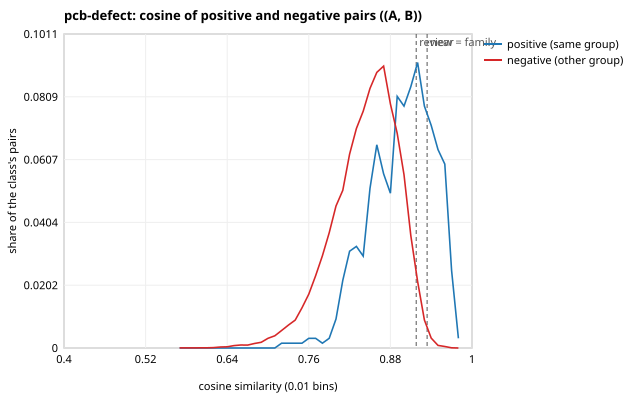
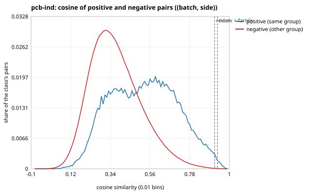
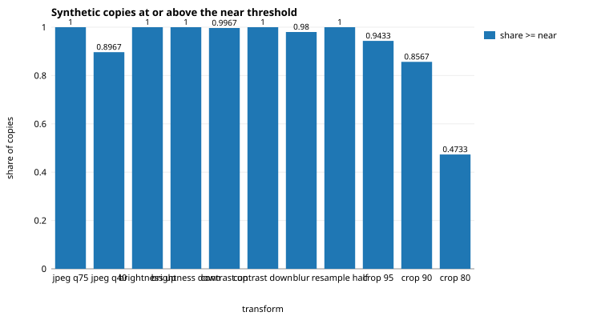

# M3 threshold calibration

Generated by `openinspect dedup analyze` from `artifacts/m3/audit.json` (re-render with `openinspect dedup report`). Rules: [docs/M3_PROTOCOL.md](../../docs/M3_PROTOCOL.md) (frozen before any leakage number was computed) and [docs/M3_PROTOCOL_AMENDMENT.md](../../docs/M3_PROTOCOL_AMENDMENT.md). Code: `a030e7b111f1`; seed 0.

A *visual similarity component* (a potential leakage group) is a connected component of image pairs whose embedding cosine reaches a threshold: evidence of potential leakage, not proof that two images show the same physical object. No image was deleted, excluded or re-labelled.

The rule of protocol section 6 is applied by `openinspect.dedup.thresholds.select_thresholds`; nothing below was tuned by hand.

Pair labels come from each source's own grouping key and are noisy in both directions (two images of one group can look unlike; two groups can carry one design), so every number here is *group-label agreement*, not accuracy. Every pair of a source is counted, so precision is the precision over the whole population of pairs.

## Pools

| source | pool | used by the rule | images | positive pairs | negative pairs | negatives per positive | ROC AUC [95% CI] | average precision [95% CI] |
|---|---|---|---|---|---|---|---|---|
| `pcb-defect` | family A | yes | 230 | 1,283 | 25,052 | 20 | 0.683 [0.644, 0.733] | 0.202 [0.162, 0.247] |
| `pcb-defect` | (A, B) | no (informational) | 230 | 642 | 25,052 | 39 | 0.790 [0.740, 0.839] | 0.278 [0.215, 0.349] |
| `pcb-ind` | (batch, side) | yes | 4,789 | 63,795 | 11,361,562 | 178 | 0.746 [0.688, 0.784] | 0.032 [0.012, 0.067] |

## Operating points

| pool | level | cosine | precision [95% CI] | recall [95% CI] | F1 | false positive rate | pairs at or above |
|---|---|---|---|---|---|---|---|
| `pcb-defect` family A | review | 0.9180 | 0.238 | 0.244 | 0.241 | 0.04000 | 1,315 |
| `pcb-defect` family A | family | 0.9180 | 0.238 [0.193, 0.281] | 0.244 [0.198, 0.313] | 0.241 | 0.04000 | 1,315 |
| `pcb-defect` family A | near | 0.9339 | 0.434 | 0.140 | 0.212 | 0.00938 | 415 |
| `pcb-defect` (A, B) | review | 0.9180 | 0.210 | 0.416 | 0.279 | 0.04000 | 1,269 |
| `pcb-defect` (A, B) | family | 0.9180 | 0.210 [0.171, 0.247] | 0.416 [0.336, 0.499] | 0.279 | 0.04000 | 1,269 |
| `pcb-defect` (A, B) | near | 0.9339 | 0.421 | 0.266 | 0.326 | 0.00938 | 406 |
| `pcb-ind` (batch, side) | review | 0.9180 | 0.195 | 0.010 | 0.018 | 0.00022 | 3,136 |
| `pcb-ind` (batch, side) | family | 0.9180 | 0.195 [0.091, 0.329] | 0.010 [0.005, 0.014] | 0.018 | 0.00022 | 3,136 |
| `pcb-ind` (batch, side) | near | 0.9339 | 0.227 | 0.005 | 0.010 | 0.00010 | 1,442 |

## How the rule produced the thresholds

| source | pool | used by the rule | cosine for precision 0.50 | cosine for precision 0.90 | F1-optimal cosine | used: review / family | fallback |
|---|---|---|---|---|---|---|---|
| `pcb-defect` | family A | yes | 0.9375 | never reached | 0.9180 | 0.9375 / 0.9180 | precision 0.90 is never reached: the F1-optimal cosine is used |
| `pcb-defect` | (A, B) | no | 0.9380 | never reached | 0.9295 | 0.9380 / 0.9295 | precision 0.90 is never reached: the F1-optimal cosine is used |
| `pcb-ind` | (batch, side) | yes | never reached | never reached | 0.7575 | 0.7575 / 0.7575 | precision 0.90 is never reached: the F1-optimal cosine is used; precision 0.50 is never reached: the F1-optimal cosine is used |

Precision is judged from the most similar pairs downwards and only where at least 50 pairs sit at or above the cosine; the search stops at the first such cosine that misses the target.

1. **family** = the largest value used over the pools of the rule = 0.9180 (`pcb-defect`) vs 0.7575 (`pcb-ind`) = **0.9180**.
2. **review** = min(family, the largest review value used over those pools) = **0.9180**.
3. **near** = max(family, the lowest over the sources of the cosine that keeps 95% of the synthetic near-duplicates): `dspcbsd-plus` 0.9364 (n = 1,000), `pcb-defect` 0.9596 (n = 1,000), `pcb-ind` 0.9339 (n = 1,000); lowest 0.9339; near = **0.9339**.
4. **pHash candidate** = the largest over the sources of the distance that covers 95% of the photometric copies: `dspcbsd-plus` 4 bits (n = 800), `pcb-defect` 2 bits (n = 800), `pcb-ind` 2 bits (n = 800); capped at 12; value **4 bits**.

## Synthetic recall at the final near threshold

`near` is the larger of `family` and the lowest per-source value, so it can be stricter than a source's own: the recall each source actually gets is measured, not assumed.

| source | target recall | source threshold | final near | achieved recall | copies | target met |
|---|---|---|---|---|---|---|
| `dspcbsd-plus` | 95.0% | 0.9364 | 0.9339 | 95.7% | 1,000 | yes |
| `pcb-defect` | 95.0% | 0.9596 | 0.9339 | 99.5% | 1,000 | yes |
| `pcb-ind` | 95.0% | 0.9339 | 0.9339 | 95.0% | 1,000 | yes |

## Uncertainty: the protocol's bootstrap and a both-sides check

The protocol resamples the positive groups and keeps the negative pairs fixed. The check resamples the units of the negative key instead (a pair between two units weighs the product of their draws), so the negatives vary too. A width ratio of 1.5 or more (or 0.67 or less), fixed before the real run, counts as a material difference.

| pool | metric | protocol interval | both-sides interval | width ratio | material |
|---|---|---|---|---|---|
| `pcb-defect` family A | ROC AUC | [0.644, 0.733] (22 groups) | [0.644, 0.729] (22 units) | 0.96 | no |
| `pcb-defect` family A | average precision | [0.162, 0.247] (22 groups) | [0.166, 0.274] (22 units) | 1.26 | no |
| `pcb-defect` family A | precision at family | [0.193, 0.281] (22 groups) | [0.176, 0.367] (22 units) | 2.17 | **yes** |
| `pcb-defect` family A | recall at family | [0.198, 0.313] (22 groups) | [0.198, 0.313] (22 units) | 1.00 | no |
| `pcb-defect` (A, B) | ROC AUC | [0.740, 0.839] (40 groups) | [0.751, 0.831] (22 units) | 0.81 | no |
| `pcb-defect` (A, B) | average precision | [0.215, 0.349] (40 groups) | [0.212, 0.394] (22 units) | 1.36 | no |
| `pcb-defect` (A, B) | precision at family | [0.171, 0.247] (40 groups) | [0.150, 0.334] (22 units) | 2.41 | **yes** |
| `pcb-defect` (A, B) | recall at family | [0.336, 0.499] (40 groups) | [0.333, 0.520] (22 units) | 1.14 | no |
| `pcb-ind` (batch, side) | ROC AUC | [0.688, 0.784] (1,069 groups) | [0.685, 0.779] (685 units) | 0.98 | no |
| `pcb-ind` (batch, side) | average precision | [0.012, 0.067] (1,069 groups) | [0.013, 0.067] (685 units) | 0.99 | no |
| `pcb-ind` (batch, side) | precision at family | [0.091, 0.329] (1,069 groups) | [0.084, 0.356] (685 units) | 1.14 | no |
| `pcb-ind` (batch, side) | recall at family | [0.005, 0.014] (1,069 groups) | [0.005, 0.015] (685 units) | 1.16 | no |

## Hash distances as a baseline score

| pool | hash | ROC AUC | average precision | best F1 | at distance (bits) |
|---|---|---|---|---|---|
| `pcb-defect` family A | phash | 0.570 | 0.145 | 0.167 | 18 |
| `pcb-defect` family A | dhash | 0.602 | 0.147 | 0.156 | 18 |
| `pcb-defect` (A, B) | phash | 0.639 | 0.190 | 0.265 | 16 |
| `pcb-defect` (A, B) | dhash | 0.653 | 0.189 | 0.257 | 16 |
| `pcb-ind` (batch, side) | phash | 0.538 | 0.007 | 0.024 | 18 |
| `pcb-ind` (batch, side) | dhash | 0.527 | 0.007 | 0.024 | 18 |

## Synthetic positives

A seeded sample of 100 images per source (seed 0); each image is compared with its own transformed copies.

| transform | kind | in the near-duplicate set | copies | cosine: median (p05 to p95) | min | pHash p95 (bits) | at or above near |
|---|---|---|---|---|---|---|---|
| jpeg_q75 | photometric | yes | 300 | 1.000 (0.999 to 1.000) | 0.982 | 0.0 | 100.0% |
| jpeg_q40 | photometric | yes | 300 | 0.979 (0.913 to 0.997) | 0.663 | 2.1 | 89.7% |
| brightness_up | photometric | yes | 300 | 0.999 (0.993 to 1.000) | 0.951 | 2.0 | 100.0% |
| brightness_down | photometric | yes | 300 | 0.999 (0.994 to 1.000) | 0.984 | 2.0 | 100.0% |
| contrast_up | photometric | yes | 300 | 0.999 (0.993 to 1.000) | 0.926 | 2.0 | 99.7% |
| contrast_down | photometric | yes | 300 | 0.999 (0.995 to 1.000) | 0.946 | 2.0 | 100.0% |
| blur | photometric | yes | 300 | 0.979 (0.952 to 0.993) | 0.892 | 2.0 | 98.0% |
| resample_half | photometric | yes | 300 | 0.994 (0.969 to 1.000) | 0.945 | 2.0 | 100.0% |
| crop_95 | geometric | yes | 300 | 0.975 (0.934 to 0.987) | 0.862 | 16.0 | 94.3% |
| crop_90 | geometric | yes | 300 | 0.963 (0.890 to 0.980) | 0.712 | 24.0 | 85.7% |
| crop_80 | partial | no | 300 | 0.932 (0.806 to 0.969) | 0.687 | 34.0 | 47.3% |

The near-duplicate set per source (pHash p95 over its photometric copies):

| source | copies | cosine: median (p05 to p95) | min | pHash p95 (bits) | at or above near |
|---|---|---|---|---|---|
| `dspcbsd-plus` | 1,000 | 0.991 (0.936 to 1.000) | 0.712 | 4.0 | 95.7% |
| `pcb-defect` | 1,000 | 0.999 (0.960 to 1.000) | 0.898 | 2.0 | 99.5% |
| `pcb-ind` | 1,000 | 0.995 (0.935 to 1.000) | 0.663 | 2.0 | 95.0% |

